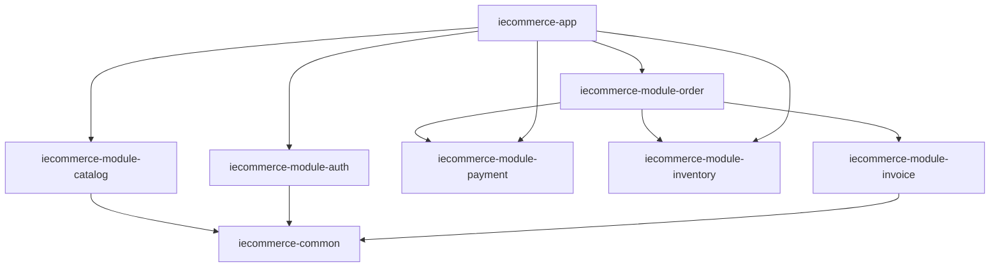

## 1. Overview
This project is an enterprise-grade **Headless (API-first) B2B2C SaaS Platform**. It is built as a **Modular Monolith** using Spring Boot and Spring Modulith. 
Our primary clients are **Merchants (Shop Owners, Service Providers, Hoteliers)** who subscribe to our API to power their own custom-designed storefronts and applications. The platform is inherently multi-tenant, enabling our clients to serve their own **End-Customers** seamlessly.

While optimized for traditional **E-commerce**, the dynamic domain model makes it highly adaptable to **Booking Systems (Appointments/Services)** and **Accommodation Systems (Hotels/Rentals)**.

## 2. Architecture Principles
- **Headless & API-First**: The backend is completely decoupled from the presentation layer. Clients design their own storefronts (Web, Mobile App, Kiosk) and consume our APIs.
- **Domain-Driven Design (DDD)**: Each module owns its domain, application logic, and infrastructure.
- **Strict Boundaries**: Modules communicate via clear APIs or internal events (Modulith).
- **Multi-Tenancy**: Shared database with row-level isolation via `tenant_id`. Every client (shop owner) operates in their own secure data silo.
- **Omnichannel & Multi-Paradigm ready**: Designed to support Physical POS, Online Storefronts, Booking Widgets, and Hotel Reservation engines using a shared core.
- **Immutability**: Financial records (Invoices, Audit Logs) are immutable.

## 3. Module Dependency Graph

## 4. Multi-Tenancy Strategy
- **Context Handling**: `TenantContext` holds the current `tenant_id` per request (ThreadLocal).
- **Entity Base**: All tenant-specific entities extend `BaseTenantEntity`.
- **Filtering**: Hibernate filters or Spring Data JPA `@Query` with `tenant_id` ensure data isolation.

## 5. Module Documentation
Detailed specifications for each module can be found in the `docs/modules/` directory:
- [Auth Module](modules/auth.md)
- [Catalog Module](modules/catalog.md)
- [Setting Module](modules/setting.md)
- [Order Module](modules/order.md)
- [Payment Module](modules/payment.md)
- [Asset Module](modules/asset.md) (Minio Storage)
- [Inventory Module](modules/inventory.md) (Physical Stock)
- [Booking Module](modules/booking.md) (Time-Based Availability)
- [Report Module](modules/report.md)
- [Notification Module](modules/notification.md) (Email, Telegram, WhatsApp)
- [Promotion Module](modules/promotion.md) (Discounts, Coupons)
- [Customer Module](modules/customer.md) (Profiles, Addresses, Loyalty)
- [Staff Module](modules/staff.md) (Employee Profiles, Roles)
- [Audit Module](modules/audit.md) (Immutable Event Trails)
- [Invoice Module](modules/invoice.md) (Billing, Receipts)
- [Chat Module](modules/chat.md) (Real-time Messaging, Support)
- [Review Module](modules/review.md) (Product Ratings, Customer Feedback)
- [Subscription Module](modules/subscription.md) (SaaS Billing, Plans, Feature Gating)

## 6. Database Performance: Indexing & Partitioning
To ensure the system remains fast as data grows into millions of rows, we follow these enterprise database strategies:

### A. Strategic Indexing
- **B-Tree Indexes**: Standard for `id`, `tenant_id`, and foreign keys.
- **GIN/GIST Indexes**: Used for **Materialized Paths** (Hierarchies) and **Full-Text Search** columns to enable "lightning-fast" searches.
- **Partial Indexes**: For high-volume tables, we index only "active" data. 
  - *Example*: `CREATE INDEX idx_active_orders ON orders(tenant_id) WHERE status != 'DELIVERED'`. This makes searches on active orders much faster by ignoring years of historical data.

### B. Soft Delete Strategy
- **Mechanism**: Every table inherits from `BaseEntity` which includes a `deleted` boolean and `deleted_at` timestamp.
- **Benefits**: Protects against accidental data loss and provides a built-in "Trash/Recycle Bin" feature.
- **Hibernate Integration**: We use `@SQLDelete` to intercept `delete` calls and `@Where(clause = "deleted = false")` to filter active data by default.

### C. Composite Partitioning (Multi-Level)
For high-volume tables (`Order`, `AuditLog`, `StockMovement`, `Notification`), we use a nesting strategy:
1. **Level 1 (List Partitioning)**: Segment data by `deleted` status.
   - `ACTIVE`: Current working data (fastest access).
   - `DELETED`: Archived data (infrequent access).
2. **Level 2 (Range Partitioning)**: Inside each status segment, we partition by **Year**.
   - **Scale**: Pre-provisioned partitions for 100+ years (e.g., `orders_2024`, `orders_2025`).
   - **Performance**: Queries for a specific year's orders only scan that specific partition (Partition Pruning).

### D. Multi-Tenancy Isolation
- **Tenant ID**: Shared database with row-level isolation via `tenant_id`.
- **Global Data**: Tenant ID is `NULL` for system-wide static data.

### E. Security, Compliance, & Error Handling
- **Opaque Errors**: The system never exposes internal stack traces or 500 error details to the client.
- **Global Exception Handler**: A centralized component intercepts all uncaught exceptions, logs the full detail for developers, and returns a generic "Internal Server Error" message with a unique **Correlation ID** to the user.
- **Encryption & Immutability**: All sensitive PII, passwords, and external integrations (e.g. Stripe Keys) are heavily encrypted or hashed. Financial records and Audit trails are strictly immutable. Please refer to the detailed [Compliance & Security Architecture](compliance_and_security.md) for full details on GDPR and SOC2 adherence.

## 7. Technology Stack
- **Java 21**: Virtual threads and modern syntax.
- **Spring Boot 3.4.3**: Core framework with Spring Modulith.
- **PostgreSQL**: Primary Relational storage (with Partitioning).
- **Keycloak**: Identity and Access Management (IAM) & SSO.
- **Redis**: Distributed Caching, Session Management, and Rate Limiting.
- **Minio**: S3-compatible Object Storage for Media and Invoices.
