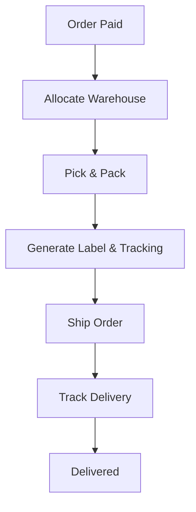

# Module Specification: Order

## 1. Purpose
The Order module manages the lifecycle of a sale, from the initial shopping cart (Draft Order) to final fulfillment and status tracking.

## 2. Core Domain Models
- **Order**: The main aggregate.
  - **Source**: `ONLINE`, `POS`, or `MOBILE_APP`.
  - **ChannelMetadata**: POS Terminal ID, Employee ID, or Session ID for physical sales.
- **OrderItem**: Individual products/variants linked to an order. 
  - *For physical items*: Includes SKU, Price, and Quantity.
  - *For accommodations*: Includes **StartDate**, **EndDate**, and **BookingMetadata**.
    - **Occupancy**: Actual number of **Adults**, **Children**, and **Pets**.
    - **Add-ons**: Linked line items for extra services (Massage, Breakfast) chosen during checkout.
- **Cart**: A temporary, transient order state for active shopping sessions/reservations.
- **ShippingAddress**: Snapshot of the customer's address. 
  - **Fields**: Street, City, **Province/State**, **Region**, Postal Code, Country.
  - **Purpose**: Used by the `Report` module for geospatial sales analysis.

## 3. Order Life Cycle (State Machine)
We use a **State Machine** pattern to ensure valid transitions:

### Order Status Lifecycle
1. **DRAFT**: Cart is active.
2. **PENDING**: Customer clicked "Checkout".
3. **WAITING_FOR_PAYMENT**: For online methods (Bakong, Stripe).
4. **PAYMENT_PENDING_ARRIVAL**: For "Pay on Arrival" method. The order is confirmed, but the balance is still due.
5. **PAID**: Transaction confirmed.
6. **CANCELLED**: Failed payment or customer request.
7. **SHIPPED**: Tracking info added.
8. **DELIVERED**: Final state.

## 4. Fulfillment Strategy
Fulfillment manages the transition from `PAID` to `DELIVERED`. It is the bridge between the digital order and the physical delivery.

### Step-by-Step Fulfillment Flow
1. **Trigger**: An `OrderPaid` event is received.
2. **Allocation**: The system identifies the best Warehouse for each item (based on proximity or stock availability).
3. **Pick & Pack**: A "Pick List" is generated for the warehouse staff to prepare the physical items.
4. **Shipping Entry**: A `Fulfillment` record is created. A shipping label is generated, and a **Tracking Number** is added.
5. **Shipment**: The order status moves to `SHIPPED`.
6. **Tracking Updates**: (Optional) The module listens for carrier updates (e.g., via webhooks from FedEx/DHL).
7. **Completion**: Once confirmed as handed over to the customer, the status moves to `DELIVERED`.

- **Partial Fulfillment**: Supports shipping items in multiple packages if they are located in different warehouses.

## 5. Refunds & Returns
Handling the reverse flow:
1. **Request**: Customer or Admin initiates a return/cancellation.
2. **Policy Check**: The system automatically looks up the **Refund Policy** and **Cancellation Window** from the `Catalog` module.
3. **Calculation**:
   - *Within Window*: 100% Refund (minus service fees).
   - *Outside Window*: Partial or 0% Refund based on the specific policy.
4. **Execution**:
   - **Payment**: Sends request to `Payment` module for reversal.
   - **Inventory/Booking**: If it was a room/service, the `Booking` module releases the date immediately.
5. **Completion**: Status becomes `REFUNDED`.

## 6. Multi-Tenancy & Performance
- **Isolation**: Each tenant manages its own Warehouses and Stock Levels.
- **Partitioning**: The `StockMovement` table is **Partitioned by Date**. Since every stock change generates a row, this table grows the fastest. Partitioning ensures audit lookups remain performant.
- **Composite Indexing**: Standard lookup index on `(tenant_id, variant_id, warehouse_id)` for O(1) stock checks.
- **Partitioning**: Core tables (`Order`, `OrderItem`) are **Partitioned by Date** (Monthly). This ensures that searching for "Recent Orders" is always fast, regardless of how many millions of historical orders exist.
- **Partial Indexing**: Indexes are optimized for active checkout flows (where `status` is not terminal).

## 5. Module Integration (Events)
The Order module is a "Coordinator":
- **Order Created**: Notifies `Notification` to send confirmation email.
- **Order Paid**: Notifies `Invoice` to generate a PDF.
- **Order Cancelled**: Notifies `Inventory` to release reserved stock.

## 6. Multi-Inventory Coordination
The Order module acts as a "Router" for availability:
- **Physical Product?** -> Calls `InventoryService.reserveStock(qty)`.
- **Bookable Product?** -> Calls `BookingService.reserveTimeSlot(range)`.

## 7. Public APIs (Internal Modulith)
- `OrderService.createCart()`: Starts a new shopping session.
- `OrderService.addItem(cartId, productId, quantity)`: Updates the cart.
- `OrderService.checkout(cartId)`: Transitions cart to a PENDING order.
- `OrderService.getHistory(customerId)`: Returns past orders.
